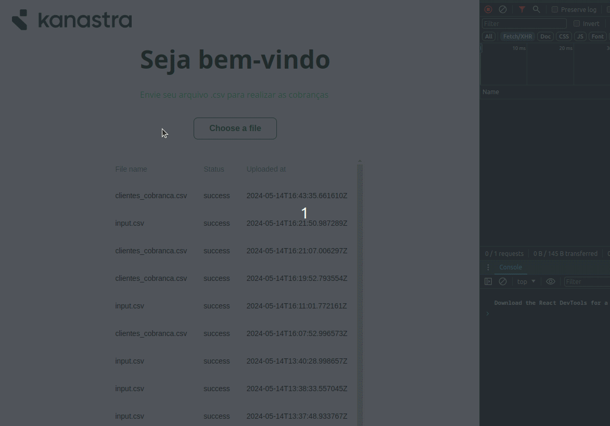

# kanastra-challenge-boilerplate

## Preview 👀



## About The Project

### Built With

- [React](https://reactjs.org/)
- [Typescript](https://www.typescriptlang.org/)
- [Tailwindcss](https://tailwindcss.com/)
- [Vite](https://vitejs.dev)
- [shadcn/ui](https://ui.shadcn.com/)
- [bun](https://bun.sh/) (But you can use [Node.js](https://nodejs.org/en) instead)

<!-- GETTING STARTED -->

## Getting Started

### Prerequisites

You need to install bun

- To install bun, run this command:
  ```sh
  curl -fsSL https://bun.sh/install | bash
  ```
  _Supported on macOS, Linux, and WSL_

#### If you're using Node instead Bun, please make sure that you Node version is 18 or higher.

_(Recommended if you're using Windows without WSL)_

### Installation

1.  Clone the repo
    ```sh
    git clone https://github.com/jotabraga/automatic-billing-front.git
    ```
2.  Install the packages

    ```sh
    bun install
    ```

    or

    ```sh
    npm i
    ```

3.  With packages installed, run development command:
    `sh
bun run dev
`
    or

        ```sh
        npm run dev:node
        ```
